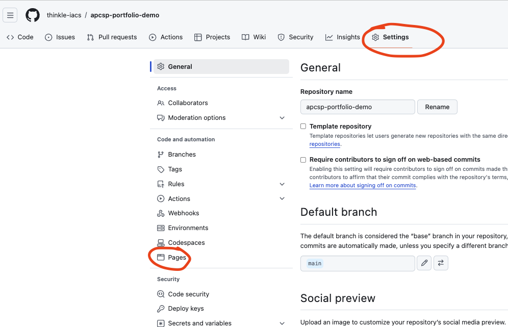
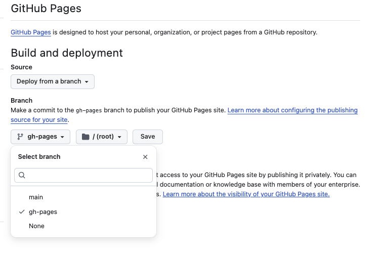
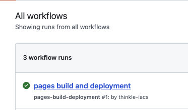
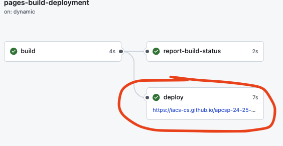

# Publishing

## How to Publish your Page

Go to your Github Repository for your project.
Go to Settings, then Pages



Once you're there, choose the Source "Deploy from a branch" and the "Branch" gh-pages (with "/ (root)") and click save.



At this point, github will deploy your page. If your github repo is at a URL like:

`https://github.com/IACS-CS/apcsp-portfolio-my-example/`

Then your page will deploy to a page like:

`https://iacs-cs.github.io/apcsp-portfolio-my-example/`

You can confirm it works by clicking on the **Actions** tab on the top of github.

You will see a workflow running -- when it completes, it will have a green checkmark icon.



If you click on the workflow, it will show you the link, which will also be available via the "Deployments"
option on the left tab.




## Broken URLs

When you publish your portfolio, if you used images, it is likely the URLs will break. What has happened is that your page has been built assuming it will be deployed at a *root* directory, but github pages deploys sites at a directory like:

```
USERNAME.github.io/PROJECT/
```

As a result, when you link to something like `/images/`, your link goes back to the root `USERNAME.github.io` URL, which breaks.

### The Fix: Step 1

Step 1 of the fix is to define a "base" URL in your project so that Astro knows what the base is.

#### Adding to astro.config.mjs

Open the file `astro.config.mjs` in your root directory.

In the build settings, you're going to add a line like this:

`base: "https://YOURPUBLISHEDURL"`

For example, my demo portfolio's astro.config.mjs looks like this:

```js
import { defineConfig } from "astro/config";

export default defineConfig({
  vite: {
    build: {
      minify: false,
      /* Change this to match YOUR portfolio */
      base: "https://thinkle-iacs.github.io/apcsp-portfolio-demo/",
    },
  }
});
```

#### Adding a <base> tag to your <Page> template

Now, to use the base, the easiest thing to do is add a `<base>` tag to your main `Page.astro` template which will tell all of your pages where to start for relative links.

Inside the `<head>` section, next to the meta tags, etc., you should add this:

```html
    <base href={import.meta.env.BASE_URL} />
```

### Step 2: Reworking URLs

Now you will want to make sure that all of your links are calculated based on the base. To do that, you should start your links and image URLs with `./` which will be equal to
the published URL of your site.

You can use the search feature to look for all links you've created. Search for:

* `<a href="`
* `
<a href="../../../">Back to Portfolio</a>
```

Now it can just look like:

```html
<!-- correct -->
<a href="./">Back to Portfolio</a>
```

An image link might have been:

```html
<!-- incorrect -->

```

Now it would be:

```html
<!-- correct -->

```

If your stylesheet had something like:

```css
html {
  /* Incorrect */
  background-image: url("/images/kitten.png");
}
```
Now it should have:

```css
html {
  /* Correct */
  background-image: url("./images/kitten.png");
}


